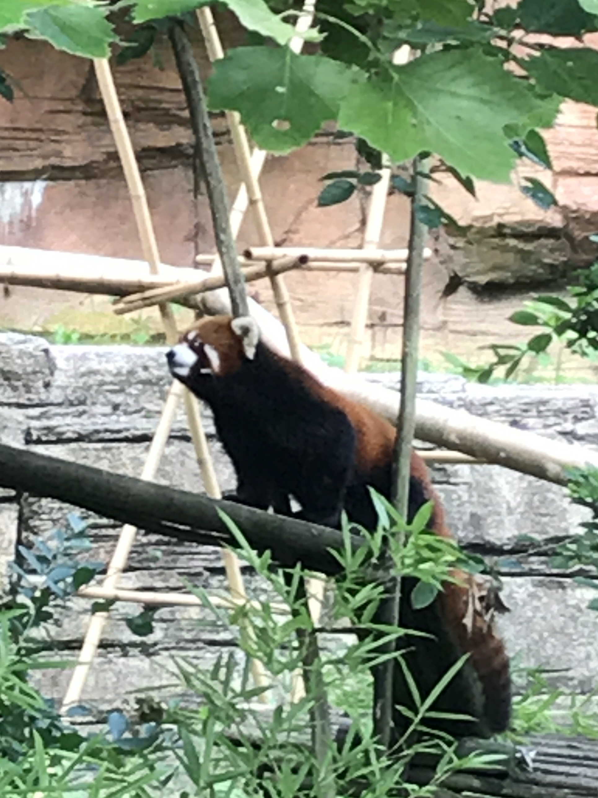

Graduate student. PhD candidate. Cosmologist. Red panda enthusiast. Black belt. Amateur musician.

## Professional

I worked on a project in undergrad callibrating a color-temperature-metallicity relation for SDSS to search for low-metallicity M dwarfs. The work was done with Dr. Jennifer Johnson and Dr. Sarah Schmidt, and resulted in both my undergraduate thesis as well as a paper updating my results with a second year of data.

My main project currently is working on an optimal method for using redMaGiC galaxies in studying [baryon acoustic oscillations](http://w.astro.berkeley.edu/~mwhite/bao/) with my advisor, Dr. Eduardo Rozo. 

I am also involved in a project with the LSST DESC large scale structure working group to analyze data from HSC. My portion of this is working on a way to get systematics maps from single exposure information. I am collaborating with Dr. David Alonso on this project.

## Personal
I studied karate for 6 years while in grade school, and attained the rank of third degree black belt. In addition to this, I was an instructor, especially for the kid's program at my karate school. I'm currently looking to start up some form of martial arts again.

I love music, and I play flute, piccolo, and some piano. I am also actively involved with my church music program, as a member of both the adult handbell choir and the chancel choir, in which I sing second soprano.

I am an occaisonal knitter, although I always feel guilty that I don't spend more time on it.

Red pandas are my favorite animal ever! They are just so adorable, especially sleeping in a tree using their tails as a blanket. My boyfriend and I enjoy traveling to different zoos (especially with red pandas), and we have also done a wildlife encounter with them. I donate/ask for people to make donation in my name to the red panda network, and think it would be awesome to go on one of their eco-trips in the future.

[comment]: 
